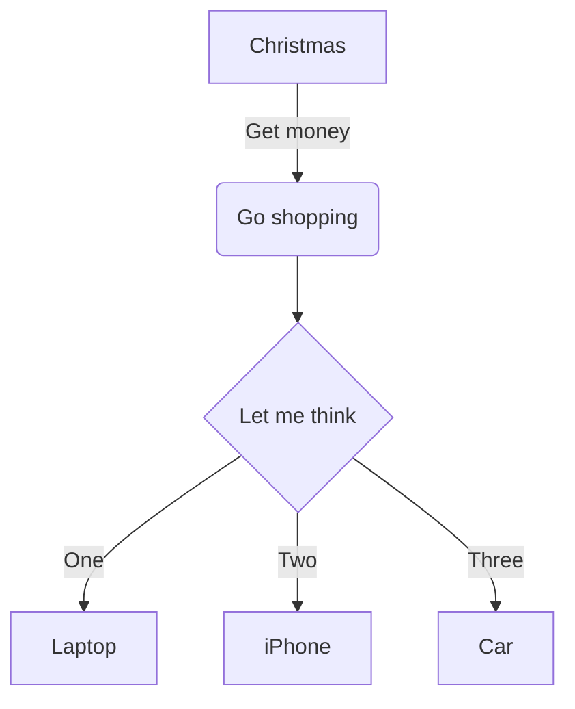
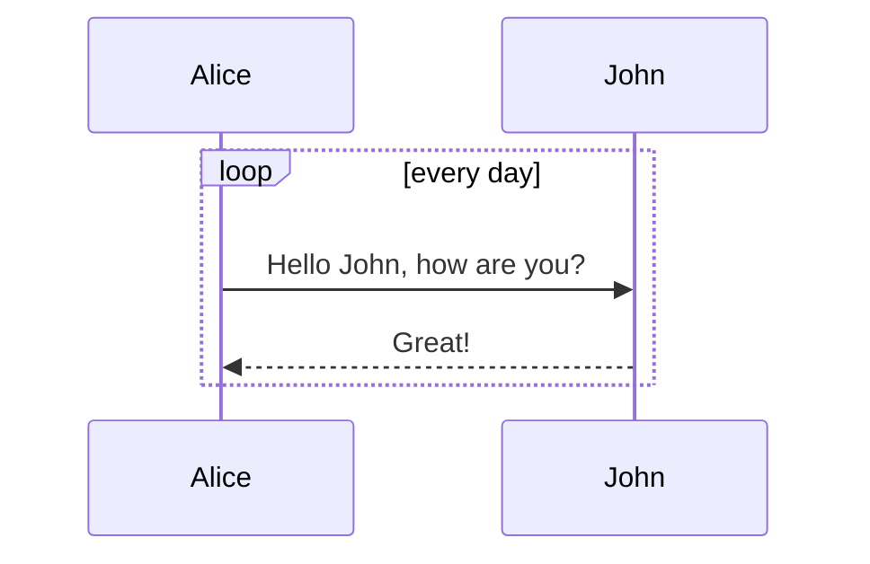
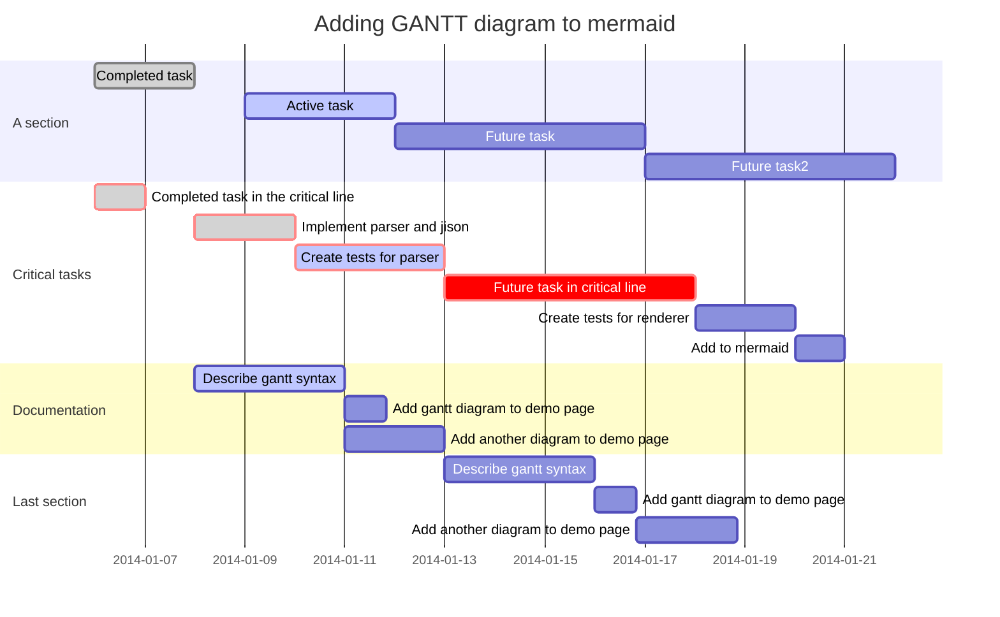
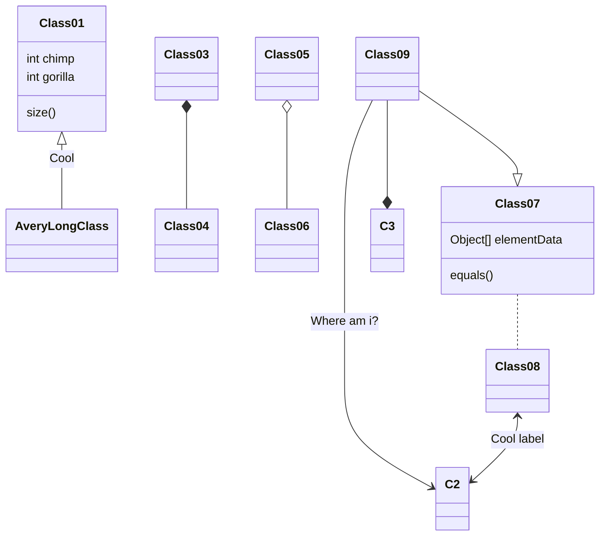

@[toc](목차)

# Font Awesome

:fa-cab: :fa-flag: :fa-bicycle: :fa-leaf: :fa-heart:

## Mathematical formula $y = x^2$

Inline math: $\dfrac{ \tfrac{1}{2}[1-(\tfrac{1}{2})^n] }{ 1-\tfrac{1}{2} } = s_n$.

Math block:

$$
\oint_C x^3\, dx + 4y^2\, dy
$$
$$
2 = \left(
\frac{\left(3-x\right) \times 2}{3-x}
\right)
$$
$$
\sum*{m=1}^\infty\sum*{n=1}^\infty\frac{m^2\,n}
{3^m\left(m\,3^n+n\,3^m\right)}
$$
$$
\phi_n(\kappa) =
\frac{1}{4\pi^2\kappa^2} \int_0^\infty
\frac{\sin(\kappa R)}{\kappa R}
\frac{\partial}{\partial R}
\left[R^2\frac{\partial D_n(R)}{\partial R}\right]\,dR
$$

## mermaid charts

### Flowchart

[Flowchart Syntax](http://knsv.github.io/mermaid/#flowcharts-basic-syntax)

::: warning
Adding many flowcharts will slow down the editor.
:::

### Sequence diagram

[Sequence Diagram Syntax](http://knsv.github.io/mermaid/#sequence-diagrams)

::: warning
Adding many sequence diagrams will slow down the editor.
:::

### Gantt diagram

[Gantt Diagram Syntax](http://knsv.github.io/mermaid/#gant-diagrams)

::: warning
Adding many gantt diagrams will slow down the editor.
:::

### Class diagram

Class diagram is powered by [mermaid](https://github.com/knsv/mermaid).

::: warning
Adding many class diagrams will slow down the editor.
:::

## Custom Container

Markup is similar to fenced code blocks. Valid container types are `success`, `info`, `warning` and `danger`.

::: info
You have new mail.
:::

::: danger
Staying up all night is bad for health.
:::
